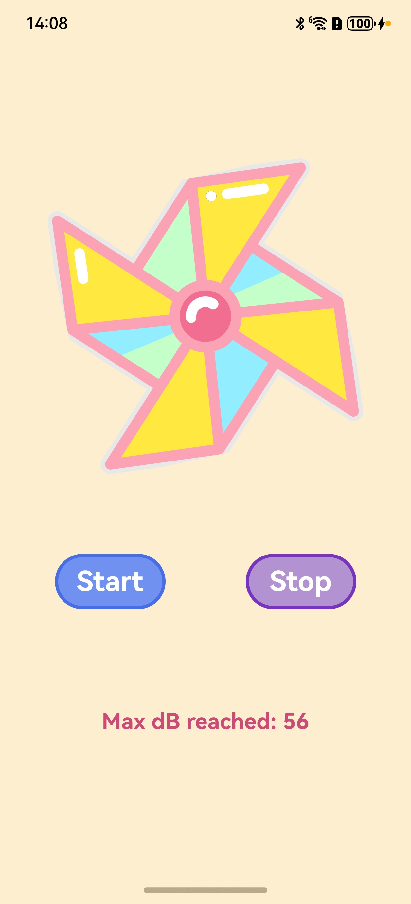

# Pinwheel
### Description
A fun and interactive application that simulates a pinwheel spinning based on your breath!

### How to Use
* Grant Microphone Access: Allow the application to access your device's microphone when prompted.
* Start the Simulation: Press the "Start" button to initialize the pinwheel.
* Blow into the Microphone: Blow into your mic to make the virtual pinwheel rotate faster. The harder you blow, the faster it spins!

.

